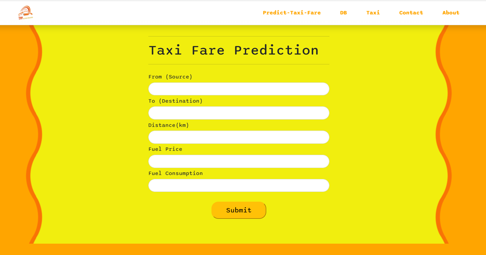

# Taxi Fare Prediction
Taxi fare prediction is a web based application which predicts the taxi fare for both inter Dzongkhags and intra Dzongkhags. The prediction is based on location, distance traveled, fuel price,number of seats and fuel consumption. 
Using this application, it enables users to know approximate taxi fare by providing information such as drop off location, pick up point, distance traveled, fuel consumption, and fuel price. This not only benefits public users but it also keeps taxi drivers informed about the uniform taxi fare.

One of the most common problems faced while traveling in a taxi is the frequent change in the taxi fare often claimed by individual taxi drivers. To reduce any illegal taxi fare charged by drivers and to reduce the need to fully depend on drivers to know the fare, we propose this project to solve the above mentioned problem. 

The aim of the project is to develop a web application where the system can predict taxi fare in the country.

## Objectives
- To predict taxi fare in order to minimize the problem faced by the riders and drivers
- To analyze previous charging trends and analysis the data
- To implement a machine learning model that can predict the fare of a taxi

To improve the model performance, we aim to collect more data and add additional features in the future. For now, we have limited data and less features.

## Alogorithm

To train the model, we used the KNN algorithm.

## Project Link : 
https://taxifareprediction.up.railway.app/

## Project Preview Screenshots
 
<b>Home Page</b>
 
 
<b>Footer</b> 
 
 
 
<b>Predication Form  page</b>
 
 
 
<b>Prediction Result page</b>
 
 
 
<b>Contact Us page</b>
 

 
<b>Prediction Result Table page</b>
 
 
 
<b>Our Team</b>
 
 
 

